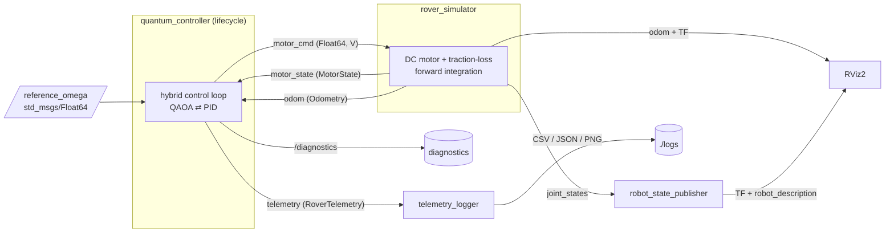

# Architecture

This document describes the ROS 2 system: packages, nodes, the runtime graph,
and the design decisions behind the hybrid quantum-classical control loop.

## Package layout

| Package | Build type | Responsibility |
|---------|-----------|----------------|
| [`quantum_rover_interfaces`](../src/quantum_rover_interfaces) | `ament_cmake` | Custom `.msg` / `.srv` / `.action` definitions. |
| [`quantum_rover_control`](../src/quantum_rover_control) | `ament_python` | Control algorithms (`core/`, `utils/`) + rclpy nodes. |
| [`quantum_rover_description`](../src/quantum_rover_description) | `ament_cmake` | URDF/xacro, RViz config, visualization launch. |
| [`quantum_rover_bringup`](../src/quantum_rover_bringup) | `ament_cmake` | Top-level launch orchestration + parameter sets. |

The control algorithms live in `quantum_rover_control/core` and `…/utils` and
carry **no ROS dependency**. This separation lets the QAOA/PID logic be
unit-tested and run as a standalone simulation (`sim_demo`) independent of the
ROS graph, while the nodes in `…/nodes` are thin adapters onto that logic.

## Runtime node graph

### Control cycle (per tick, default 100 Hz)

1. Read latest `motor_state.omega` and `odom.pose.position.x`.
2. Form the error state `x = [position_error, velocity_error]`.
3. Ask the active optimizer for a normalized action `u ∈ [-1, 1]`
   (QAOA on the Aer simulator, or the PID fallback).
4. Scale to a motor voltage `V = clip(u · pwm_max, ±pwm_max)` and publish on
   `motor_cmd`.
5. Evaluate the LQR cost `J = xᵀQx + uᵀRu`, publish `RoverTelemetry`, and
   throttle a `DiagnosticArray` at ~2 Hz.

The simulator integrates the plant at `sim_frequency` (default 1 kHz) and
publishes observable state at `publish_frequency` (default 100 Hz).

## Interfaces

### Topics

| Topic | Type | Dir (controller) | QoS |
|-------|------|------------------|-----|
| `reference_omega` | `std_msgs/Float64` | sub | reliable, depth 10 |
| `motor_state` | `quantum_rover_interfaces/MotorState` | sub | reliable, depth 10 |
| `odom` | `nav_msgs/Odometry` | sub | sensor data |
| `motor_cmd` | `std_msgs/Float64` | pub (lifecycle) | reliable, depth 10 |
| `telemetry` | `quantum_rover_interfaces/RoverTelemetry` | pub (lifecycle) | reliable, depth 10 |
| `/diagnostics` | `diagnostic_msgs/DiagnosticArray` | pub (lifecycle) | depth 10 |
| `joint_states` | `sensor_msgs/JointState` | (from sim) | depth 10 |

### Services (controller)

| Service | Type | Purpose |
|---------|------|---------|
| `~/set_control_mode` | `SetControlMode` | Switch QAOA ⇄ PID at runtime. |
| `~/optimize_control` | `OptimizeControl` | Stateless single-shot optimization. |

### Action (controller)

| Action | Type | Purpose |
|--------|------|---------|
| `~/follow_velocity_profile` | `FollowVelocityProfile` | Drive a sequence of velocity setpoints and report RMSE/IAE/energy with live feedback. |

## Why a lifecycle node?

The controller is a **managed (lifecycle) node** so an orchestrator can bring it
up deterministically: configure (allocate the optimizer, publishers, services,
action) without emitting commands, then activate to start the control timer.
While `inactive` the lifecycle publishers stay silent — no stray voltage is
ever sent to the plant during startup or reconfiguration. The bringup launch
files drive the `configure → activate` transitions automatically through the
launch event system.

## Why keep a PID fallback?

QAOA runs on a NISQ-era simulator and adds 50–150 ms of latency per cycle; the
quantum backend (Qiskit/Aer) is also an *optional* dependency. The controller
therefore degrades gracefully: if Qiskit is unavailable or QAOA initialization
fails, it transparently falls back to a tuned PID controller, and telemetry
records which backend produced each sample so the two can be benchmarked
head-to-head (see [`utils/data_logger.py`](../src/quantum_rover_control/quantum_rover_control/utils/data_logger.py)).

For the underlying mathematics (QAOA circuit, LQR formulation, DC-motor model)
see [THEORY.md](THEORY.md).
